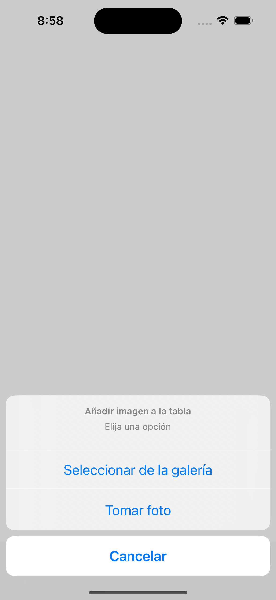
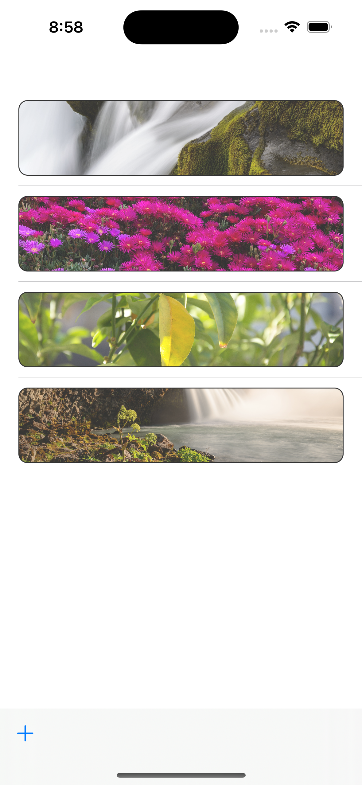
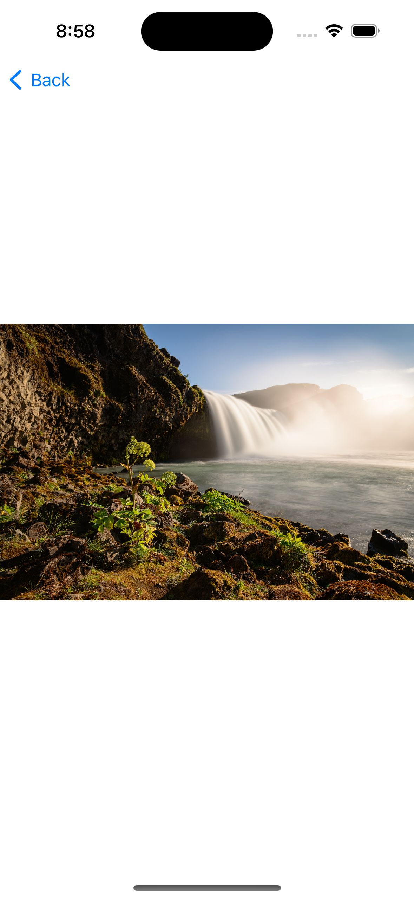

# CamCatcher

CamCatcher es una aplicación móvil desarrollada en Swift que te permite capturar imágenes utilizando la cámara o seleccionándolas desde la galería, y mostrarlas en una lista y en pantalla completa. Hay dos versiones, una en SwiftUI y otra en UIKit. Ambas similares y funcionando perfectamente.

## Características

- Captura de imágenes desde la cámara.
- Selección de imágenes desde la galería.
- Visualización de imágenes en una lista.
- Visualización de imágenes en pantalla completa.
- Interfaz de usuario intuitiva y fácil de usar.

## Capturas de pantalla

## Requisitos

- iOS 13.0+
- Xcode 12.0+
- Swift 5.0+

## Instalación

1. Clona el repositorio en tu máquina local.
2. Abre el proyecto en Xcode.
3. Compila y ejecuta la aplicación en un simulador o dispositivo iOS.

## Contribución

¡Las contribuciones son bienvenidas! Si deseas contribuir a este proyecto, por favor sigue estos pasos:

1. Haz un fork del proyecto.
2. Crea una nueva rama (`git checkout -b feature/nueva-caracteristica`).
3. Haz tus cambios y realiza commit (`git commit -am 'Agrega nueva característica'`).
4. Sube tus cambios a tu fork (`git push origin feature/nueva-caracteristica`).
5. Abre un Pull Request.

## Licencia

Este proyecto está licenciado bajo la Licencia MIT. Consulta el archivo `LICENSE` para obtener más detalles.

## Contacto

Para cualquier pregunta o comentario, no dudes en ponerte en contacto conmigo a través de [correo electrónico](mailto:leinadhunter10@hotmail.com)
